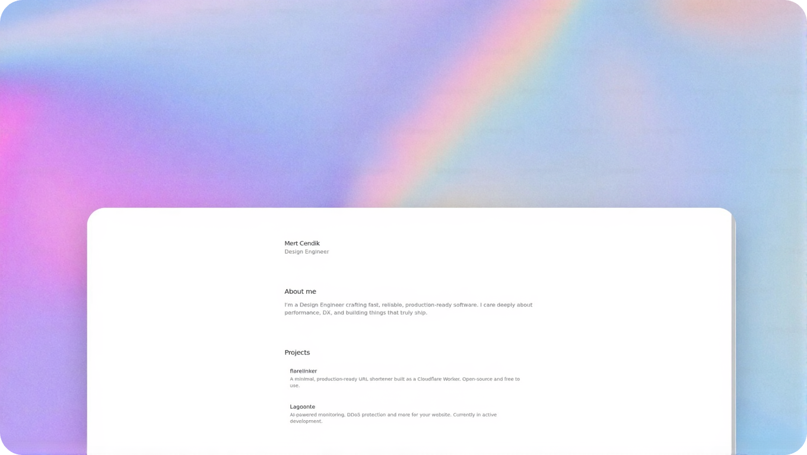

My personal website built with Next.js, TypeScript, and MDX.

## Features

- Built with **Next.js 16** (App Router) and **React 19**
- Styled with **Tailwind CSS v4**
- Fully responsive design for all devices
- Dark mode support (system preference + manual toggle)
- MDX support: Write posts in Markdown with React components
- Syntax highlighting: Code blocks with `rehype-highlight`
- Reading time: Auto-calculated reading time estimates
- View counter: Real-time page views using Upstash Redis
- Media: Optimized images and video components (local & YouTube)
- RSS feed: Automatically generated RSS 2.0 feed
- Command menu: `Cmd+K` interface for quick navigation (built with `cmdk`)
- Animations: Smooth page transitions and micro-interactions with Framer Motion
- Newsletter: Email subscription form with Resend
- Share: Copy link functionality with visual feedback
- Progress bar: Reading progress indicator on blog posts
- SEO: Optimized metadata, Open Graph, JSON-LD, and sitemap
- Accessibility: Semantic HTML, ARIA labels, skip-to-content, and reduced motion support
- Performance: Optimized fonts (`next/font`), analytics, and speed insights
- Security: Configured security headers (HSTS, X-Frame-Options, etc.)

## Tech stack

- Framework: Next.js 16
- Language: TypeScript
- Styling: Tailwind CSS v4 + shadcn/ui
- Animations: Framer Motion
- Content: MDX
- Database: Upstash Redis (for view counts)
- Email: Resend
- Forms: React Hook Form + Zod
- Icons: Lucide React

## Getting started

### Prerequisites

- Node.js 20+
- Package manager: npm, yarn, pnpm, or bun (recommended)

### Installation

1. Clone the repository

   ```bash
   git clone https://github.com/mxrtcendik/mertcendik.git
   cd mertcendik
   ```

2. Install dependencies

   ```bash
   bun install
   ```

3. Environment setup

   Rename `.env.example` to `.env.local` and fill in the required values:

   ```bash
   cp .env.example .env.local
   ```

   | Variable                   | Description                           |
   | -------------------------- | ------------------------------------- |
   | `RESEND_API_KEY`           | API key for sending emails via Resend |
   | `VIEW_COUNTER_ENABLED`     | Set to `true` to enable view counting |
   | `UPSTASH_REDIS_REST_URL`   | Redis URL for view counts             |
   | `UPSTASH_REDIS_REST_TOKEN` | Redis token for view counts           |

4. Configuration

   Update your personal information in `lib/constants.ts`:

   ```typescript
   export const personalInfo: PersonalInfo = {
     name: "Your Name",
     title: "Your Title",
     about: "Your bio...",
     email: "your@email.com",
     baseUrl: "https://yourdomain.com",
   };
   ```

5. Run development server

   ```bash
   bun run dev
   ```

   Visit `http://localhost:3000` in your browser to see your website in real-time!

## Writing posts

Create new `.mdx` files in the `content/blog/` directory. Use the following frontmatter format:

````mdx
---
title: "Your post title"
date: "2025-11-26"
---

Write your post content here...

## Code example

```javascript
console.log("Hello world!");
```
````

## Deployment

This project is optimized for deployment on Vercel but you can deploy it to any other platform or self-host it on your own VPS.

1. Push your code to a GitHub repository.
2. Import the project in Vercel.
3. Add your environment variables in the Vercel dashboard.
4. Deploy!

## License

This project is open source and available under the [MIT License](LICENSE).