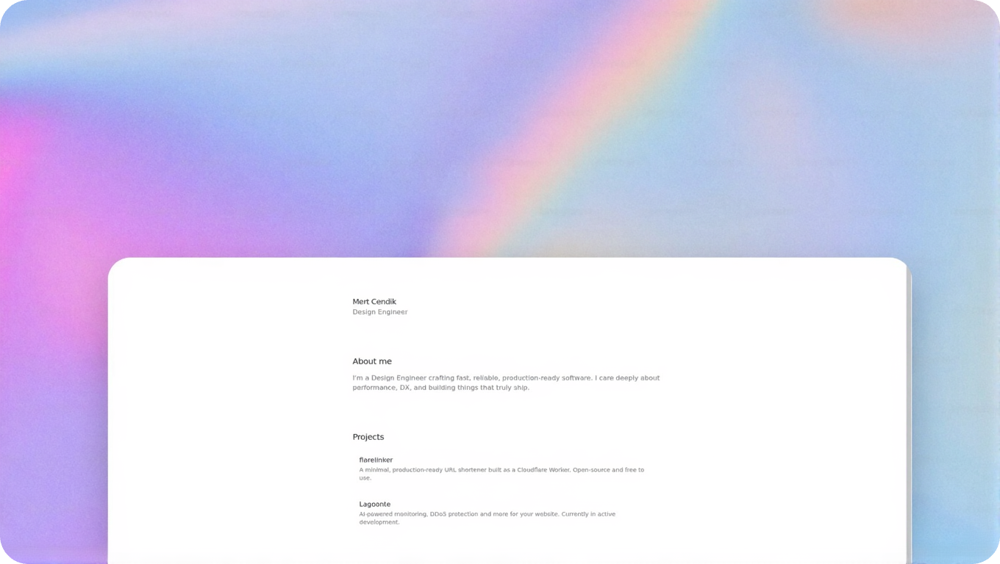

My personal website built with Next.js, TypeScript, and MDX. Features MDX support for blog posts with image and video capabilities.

## Features

- Minimal, clean design
- MDX blog with frontmatter support
- Image support (local and external)
- Video components (local videos and YouTube embeds)
- Built with Next.js 16 (App Router)
- TypeScript for type safety
- Tailwind CSS for styling
- Fully responsive

## Getting started

### Prerequisites

- Node.js 20+
- Package manager: npm, yarn, pnpm, or bun

### Installation

1. Clone the repository:

```bash
git clone https://github.com/mxrtcendik/mertcendik.git
cd mertcendik
```

2. Install dependencies:

```bash
bun install
```

3. Update your personal information in `lib/constants.ts`:

```typescript
export const personalInfo: PersonalInfo = {
  name: "Your Name",
  title: "Your Title",
  about: "Your bio...",
  email: "your@email.com",
};
```

4. Update metadata in `app/layout.tsx`:

```typescript
export const metadata: Metadata = {
  title: "Your Name",
  description: "Your description",
};
```

5. Run the development server:

```bash
bun run dev
```

6. Open [http://localhost:3000](http://localhost:3000) in your browser.

## Adding Blog Posts

Create `.mdx` files in the `content/blog/` directory with frontmatter:

```mdx
---
title: My first blog post
date: 2025-11-17
---

Your blog post content here.

## Images


## Videos

<Video src="/video.mp4" title="My video" />

## YouTube

<YouTube id="video-id" title="Video title" />
```

## Building for production

```bash
bun run build
```

## Tech stack

- [Next.js](https://nextjs.org/) - React framework
- [TypeScript](https://www.typescriptlang.org/) - Type safety
- [Tailwind CSS](https://tailwindcss.com/) - Styling
- [MDX](https://mdxjs.com/) - Markdown with JSX
- [next-mdx-remote](https://github.com/hashicorp/next-mdx-remote) - MDX rendering
- [bun](https://bun.sh/) - Package manager

## License

MIT (see [LICENSE](https://github.com/mxrtcendik/mertcendik/blob/main/LICENSE))
